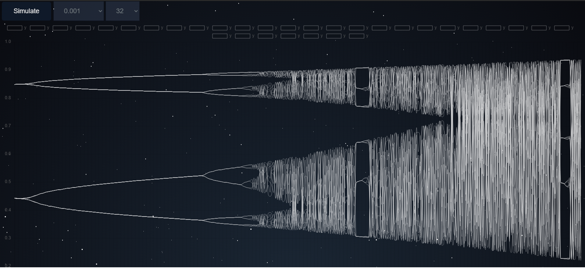
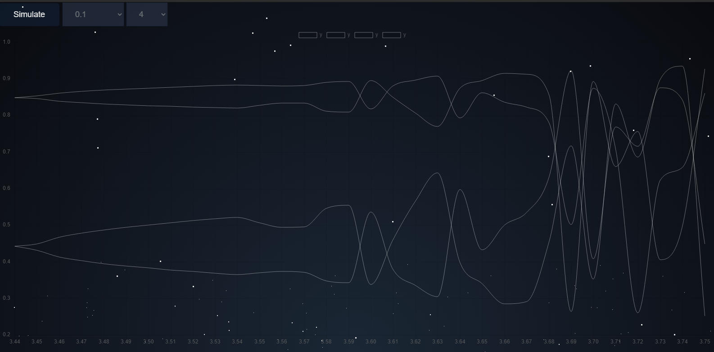

# Bifurcation diagram

### ABOUT  

- The logistic map is a polynomial mapping of degree 2, often cited as an archetypal example of how complex, chaotic behaviour can arise from very simple non-linear dynamical equations.

- https://en.wikipedia.org/wiki/Logistic_map 

- https://hypertextbook.com/chaos/bifurcation/

